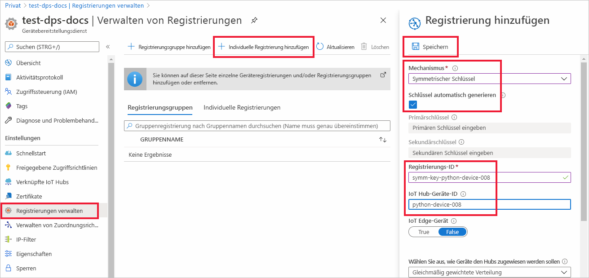
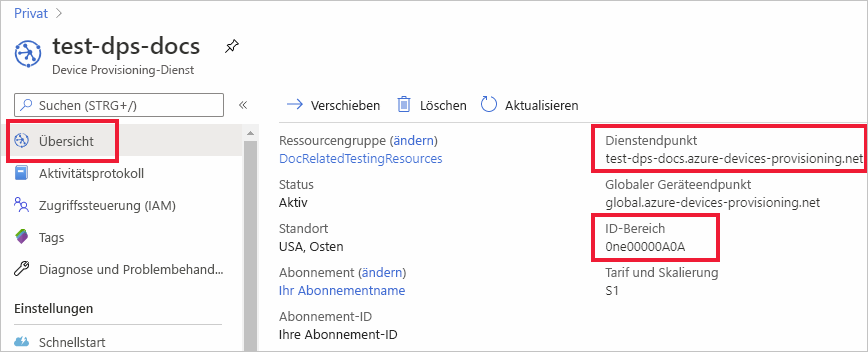

# <a name="quickstart-provision-a-python-device-with-symmetric-keys"></a>Schnellstart: Bereitstellen eines Python-Geräts mit symmetrischen Schlüsseln

In dieser Schnellstartanleitung erfahren Sie, wie Sie mithilfe von Python einen Windows-Entwicklungscomputer als Gerät für einen IoT-Hub bereitstellen. Dieses Gerät verwendet einen symmetrischen Schlüssel für die Authentifizierung bei einer Device Provisioning Service-Instanz (DPS-Instanz), damit es einem IoT-Hub zugewiesen werden kann. Das authentifizierte Gerät wird von DPS anhand einer individuellen Registrierung erkannt und einem IoT-Hub zugewiesen. Zum Bereitstellen des Geräts wird Beispielcode aus dem [Azure IoT Python SDK](https://github.com/Azure/azure-iot-sdk-python) verwendet. 

In diesem Artikel wird die Bereitstellung mit einer individuellen Registrierung erörtert. Sie können jedoch auch Registrierungsgruppen verwenden. Bei der Verwendung von Registrierungsgruppen gibt es einige Unterschiede. Sie müssen beispielsweise einen abgeleiteten Geräteschlüssel mit einer eindeutigen Registrierungs-ID für das Gerät verwenden. Obwohl Registrierungsgruppen mit symmetrischem Schlüssel nicht auf veraltete Geräte begrenzt sind, enthält [Bereitstellen veralteter Geräte mit Nachweis durch symmetrischen Schlüssel](how-to-legacy-device-symm-key.md) ein Beispiel für eine Registrierungsgruppe. Weitere Informationen finden Sie unter [Gruppenregistrierungen für Nachweis des symmetrischen Schlüssels](concepts-symmetric-key-attestation.md#group-enrollments).

Sollten Sie mit der automatischen Bereitstellung nicht vertraut sein, lesen Sie die Informationen unter [Konzepte für die automatische Bereitstellung](concepts-auto-provisioning.md). 

Vergewissern Sie sich außerdem, dass Sie die Schritte unter [Einrichten des IoT Hub Device Provisioning-Diensts über das Azure-Portal](./quick-setup-auto-provision.md) ausgeführt haben, bevor Sie mit dieser Schnellstartanleitung fortfahren. In dieser Schnellstartanleitung wird vorausgesetzt, dass Sie bereits eine Device Provisioning-Instanz erstellt haben.

In diesem Artikel wird von der Nutzung einer Windows-Arbeitsstation ausgegangen. Allerdings können Sie die Verfahren auch unter Linux ausführen. Ein Beispiel für Linux finden Sie unter [Bereitstellen für Mehrinstanzenfähigkeit](how-to-provision-multitenant.md).


[!INCLUDE [quickstarts-free-trial-note](../../includes/quickstarts-free-trial-note.md)]


## <a name="prerequisites"></a>Voraussetzungen

* Stellen Sie sicher, dass auf Ihrem Windows-basierten Computer [Python 3.7](https://www.python.org/downloads/) oder höher installiert ist. Durch Ausführen von `python --version` können Sie überprüfen, welche Python-Version verwendet wird.

* Die neueste Version von [Git](https://git-scm.com/download/) ist installiert.

<a id="setupdevbox"></a>

## <a name="prepare-the-python-sdk-environment"></a>Vorbereiten der Python SDK-Umgebung 

1. Vergewissern Sie sich, dass Git auf Ihrem Computer installiert ist und den Umgebungsvariablen hinzugefügt wurde, auf die das Befehlsfenster Zugriff hat. Unter [Git-Clienttools von Software Freedom Conservancy](https://git-scm.com/download/) finden Sie die neueste Version der zu installierenden `git`-Tools. Hierzu zählt auch die Befehlszeilen-App **Git Bash**, über die Sie mit Ihrem lokalen Git-Repository interagieren können. 

2. Öffnen Sie eine Eingabeaufforderung. Klonen Sie das GitHub-Repository für das Azure IoT Python SDK:
    
    ```console
    git clone https://github.com/Azure/azure-iot-sdk-python.git --recursive
    ```
3. Navigieren Sie zum Verzeichnis `azure-iot-sdk-python\azure-iot-device\samples\async-hub-scenarios`, in dem sich die Beispieldatei _provision_symmetric_key.py_ befindet.
   
   ```console
   cd azure-iot-sdk-python\azure-iot-device\samples\async-hub-scenarios
   ```
4. Installieren Sie die Bibliothek _azure-iot-device_, indem Sie den folgenden Befehl ausführen.

    ```console
    pip install azure-iot-device
    ```


## <a name="create-a-device-enrollment"></a>Erstellen einer Geräteregistrierung

1. Melden Sie sich beim [Azure-Portal](https://portal.azure.com) an, wählen Sie im Menü links die Schaltfläche **Alle Ressourcen** aus, und öffnen Sie Ihre Device Provisioning Service-Instanz (DPS).

2. Wählen Sie die Registerkarte **Registrierungen verwalten** und dann oben die Schaltfläche **Individuelle Registrierung hinzufügen** aus. 

3. Geben Sie im Bereich **Registrierung hinzufügen** die folgenden Informationen ein, und wählen Sie die Schaltfläche **Speichern** aus.

   - **Mechanismus**: Wählen Sie **Symmetrischer Schlüssel** als *Mechanismus* für den Nachweis der Identität aus.

   - **Schlüssel automatisch generieren:** Aktivieren Sie dieses Kontrollkästchen.

   - **Registrierungs-ID**: Geben Sie eine Registrierungs-ID ein, um die Registrierung zu identifizieren. Verwenden Sie nur Kleinbuchstaben und Bindestriche („-“). Beispiel: **symm-key-python-device-008**.

   - **IoT Hub-Geräte-ID**: Geben Sie einen Gerätebezeichner ein. Beispiel: **python-device-008**.

     

4. Nachdem Sie Ihre Registrierung gespeichert haben, werden der **Primärschlüssel** und der **Sekundärschlüssel** generiert und dem Registrierungseintrag hinzugefügt. Die Registrierung Ihres Geräts mit symmetrischem Schlüssel wird auf der Registerkarte *Individuelle Registrierungen* in der Spalte *Registrierungs-ID* als **symm-key-python-device-008** angezeigt. 

5. Öffnen Sie die Registrierung, und kopieren Sie den Wert des von Ihnen generierten **Primärschlüssels**. Sie verwenden diesen Schlüsselwert und die **Registrierungs-ID** später, wenn Sie Umgebungsvariablen zur Verwendung mit dem Beispielcode für die Gerätebereitstellung hinzufügen.


<a id="firstbootsequence"></a>

## <a name="prepare-the-device-provisioning-code"></a>Vorbereiten des Gerätebereitstellungscodes

In diesem Abschnitt fügen Sie die folgenden vier Umgebungsvariablen hinzu, die als Parameter für den Beispielcode der Gerätebereitstellung für Ihr Gerät mit symmetrischem Schlüssel verwendet werden. 

* `PROVISIONING_HOST`
* `PROVISIONING_IDSCOPE`
* `PROVISIONING_REGISTRATION_ID`
* `PROVISIONING_SYMMETRIC_KEY`

Der Bereitstellungscode kontaktiert die DPS-Instanz basierend auf diesen Variablen, um Ihr Gerät zu authentifizieren. Anschließend wird das Gerät basierend auf der Konfiguration der individuellen Registrierung einem bereits mit der DPS-Instanz verknüpften IoT-Hub zugewiesen. Nach der Bereitstellung sendet der Beispielcode einige Testtelemetriedaten an den IoT-Hub.

1. Wählen Sie im [Azure-Portal](https://portal.azure.com) im Device Provisioning Service-Menü die Option **Übersicht** aus, und kopieren Sie Ihren _Dienstendpunkt_ und den _ID-Bereich_. Sie verwenden diese Werte für die Umgebungsvariablen `PROVISIONING_HOST` und `PROVISIONING_IDSCOPE`.

    

2. Fügen Sie in der Python-Eingabeaufforderung die Umgebungsvariablen mit den Werten hinzu, die Sie kopiert haben. 

    Die folgenden Befehle dienen als Beispiele, um die Befehlssyntax aufzuzeigen. Stellen Sie sicher, dass Sie die richtigen Werte verwenden.

    ```console
    set PROVISIONING_HOST=test-dps-docs.azure-devices-provisioning.net
    ```

    ```console
    set PROVISIONING_IDSCOPE=0ne00000A0A
    ```

3. Fügen Sie in der Python-Eingabeaufforderung die Umgebungsvariablen für die Registrierungs-ID und den symmetrischen Schlüssel hinzu, die Sie im vorherigen Abschnitt aus der individuellen Registrierung kopiert haben. 

    Die folgenden Befehle dienen als Beispiele, um die Befehlssyntax aufzuzeigen. Stellen Sie sicher, dass Sie die richtigen Werte verwenden.

    ```console
    set PROVISIONING_REGISTRATION_ID=symm-key-python-device-008
    ```

    ```console
    set PROVISIONING_SYMMETRIC_KEY=sbDDeEzRuEuGKag+kQKV+T1QGakRtHpsERLP0yPjwR93TrpEgEh/Y07CXstfha6dhIPWvdD1nRxK5T0KGKA+nQ==
    ```

4. Führen Sie den Python-Beispielcode in der Datei _provision_symmetric_key.py_ aus.

    ```console
    D:\azure-iot-sdk-python\azure-iot-device\samples\async-hub-scenarios>python provision_symmetric_key.py
    ```

5. Die erwartete Ausgabe sollte in etwa der im folgenden Screenshot dargestellten Ausgabe entsprechen. Darin ist der verknüpfte IoT-Hub enthalten, dem das Gerät basierend auf den Einstellungen der individuellen Registrierung zugewiesen wurde. Zu Testzwecken werden auch einige Beispielnachrichten mit Telemetriedaten zur Windgeschwindigkeit an den Hub gesendet:

    ```output
    D:\azure-iot-sdk-python\azure-iot-device\samples\async-hub-scenarios>python provision_symmetric_key.py
    RegistrationStage(RequestAndResponseOperation): Op will transition into polling after interval 2.  Setting timer.
    The complete registration result is
    python-device-008
    docs-test-iot-hub.azure-devices.net
    initialAssignment
    null
    Will send telemetry from the provisioned device
    sending message #8
    sending message #9
    sending message #3
    sending message #10
    sending message #4
    sending message #2
    sending message #6
    sending message #7
    sending message #1
    sending message #5
    done sending message #8
    done sending message #9
    done sending message #3
    done sending message #10
    done sending message #4
    done sending message #2
    done sending message #6
    done sending message #7
    done sending message #1
    done sending message #5
    ```
    
6. Navigieren Sie im Azure-Portal zu dem mit Ihrem Bereitstellungsdienst verknüpften IoT-Hub, und öffnen Sie das Blatt **IoT-Geräte**. Nach der erfolgreichen Bereitstellung des Geräts mit symmetrischen Schlüssel für den Hub wird die Geräte-ID mit dem *STATUS* **Aktiviert** angezeigt. Wenn Sie das Blatt bereits vor dem Ausführen des Gerätebeispielcodes geöffnet haben, müssen Sie möglicherweise im oberen Bereich auf die Schaltfläche **Aktualisieren** klicken. 

     

> [!NOTE]
> Wenn Sie den *anfänglichen Gerätezwillingsstatus* im Registrierungseintrag für Ihr Gerät gegenüber dem Standardwert geändert haben, kann der gewünschte Zwillingsstatus vom Hub abgerufen werden, und es können entsprechende Aktionen durchgeführt werden. Weitere Informationen finden Sie unter [Verstehen und Verwenden von Gerätezwillingen in IoT Hub](../iot-hub/iot-hub-devguide-device-twins.md).
>


## <a name="clean-up-resources"></a>Bereinigen von Ressourcen

Wenn Sie das Geräteclientbeispiel weiterhin verwenden und erkunden möchten, überspringen Sie die Bereinigung der in diesem Schnellstart erstellten Ressourcen. Falls Sie nicht fortfahren möchten, führen Sie die folgenden Schritte aus, um alle Ressourcen zu löschen, die im Rahmen dieses Schnellstarts erstellt wurden.

1. Wählen Sie im Azure-Portal im Menü links **Alle Ressourcen** und dann Ihren Gerätebereitstellungsdienst aus. Öffnen Sie **Registrierungen verwalten** für Ihren Dienst, und wählen Sie dann die Registerkarte **Individuelle Registrierungen** aus. Aktivieren Sie das Kontrollkästchen *REGISTRIERUNGS-ID* für das Gerät, das Sie in diesem Schnellstart registriert haben, und wählen Sie oben im Bereich die Schaltfläche **Löschen** aus. 
1. Wählen Sie im linken Menü im Azure-Portal **Alle Ressourcen** und dann Ihren IoT-Hub aus. Öffnen Sie **IoT-Geräte** für Ihren Hub, aktivieren Sie das Kontrollkästchen der *Geräte-ID* des Geräts, das Sie in diesem Schnellstart registriert haben, und wählen Sie dann die Schaltfläche **Löschen** am oberen Rand des Bereichs aus.

## <a name="next-steps"></a>Nächste Schritte

In diesem Schnellstart haben Sie mithilfe von IoT Hub Device Provisioning Service ein Windows-basiertes Gerät mit symmetrischem Schlüssel für Ihren IoT-Hub bereitgestellt. Wenn Sie erfahren möchten, wie Sie mithilfe von Python Geräte mit X.509-Zertifikat bereitstellen, lesen Sie die folgende Schnellstartanleitung für X.509-Geräte. 

> [!div class="nextstepaction"]
> [Azure-Schnellstart: Bereitstellen eines X.509-Geräts mithilfe von DPS und Python](quick-create-simulated-device-x509-python.md)
