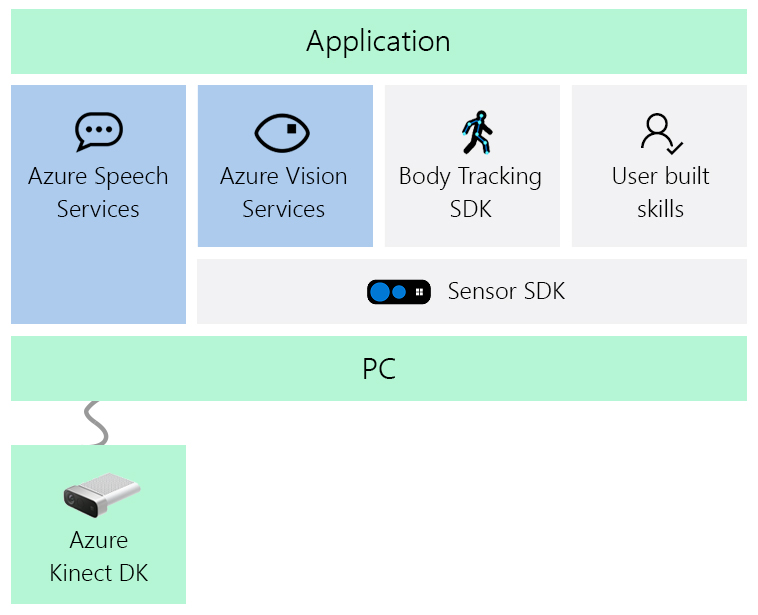

# Informationen zu Azure Kinect DK

 

Azure Kinect DK ist ein Entwicklerkit mit erweiterten KI-Sensoren, das komplexe Modelle für maschinelles Sehen sowie Sprachmodelle bereitstellt.  Kinect enthält einen Tiefensensor, ein räumliches Mikrofonarray mit einer Videokamera und einen Orientierungssensor in Form eines kleinen All-in-One-Geräts mit mehreren Modi, Optionen und Software Development Kits (SDKs). Es kann im [Microsoft Online Store](https://www.microsoft.com/p/azure-kinect-dk/8pp5vxmd9nhq) erworben werden.

Die Azure Kinect DK-Entwicklungsumgebung besteht aus den folgenden SDKs:

- Sensor SDK für den Low Level-Zugriff auf Sensor und Geräte.
- Body Tracking SDK für die Nachverfolgung von Körpern in 3D.
- Speech Cognitive Services SDK zur Realisierung von Mikrofonzugriff und Azure Cloud-basierten Sprachdiensten.

Darüber hinaus können Cognitive Vision-Dienste in Verbindung mit der RGB-Kamera des Geräts verwendet werden.

   

## Sensor SDK für Azure Kinect

Das Sensor SDK für Azure Kinect bietet Low Level-Zugriff auf Hardwaresensoren von Azure Kinect DK und die Gerätekonfiguration.

Weitere Informationen über das Azure Kinect Sensor SDK finden Sie unter [Verwenden des Sensor SDK](about-sensor-sdk.md).

### Features des Sensor SDK für Azure Kinect

Das Sensor SDK weist die folgenden Features auf, die nach der Installation bei der Ausführung im Azure Kinect DK genutzt werden können:

- Zugriff auf die Tiefenkamera und Modussteuerung (ein passiver IR-Modus zuzüglich weiterer Tiefenmodi mit breitem und engem Bildwinkel) 
- Zugriff auf die RGB-Kamera und deren Steuerung (z. B. Belichtung und Weißabgleich) 
- Zugriff auf Bewegungssensoren (Gyroskop und Beschleunigungsmesser) 
- Synchronisiertes Streaming von Tiefen- und RGB-Kamera mit konfigurierbarer Verzögerung zwischen den Kameras 
- Externe Steuerung der Gerätesynchronisierung mit konfigurierbarem Verzögerungsoffset zwischen den Geräten 
- Zugriff auf Metadaten von Kameraframes für Bildauflösung, Zeitstempel usw. 
- Zugriff auf Kalibrierungsdaten von Geräten 

### Azure Kinect Sensor SDK-Tools

Die folgenden Tools stehen im Sensor SDK zur Verfügung:

- Ein Viewertool zum Überwachen der Datenströme von Geräten und zum Konfigurieren verschiedener Modi.
- Ein Sensor-Aufzeichnungstool und eine Leser-API für die Wiedergabe, die das Matroska-Containerformat verwenden.
- Ein Firmwareupdate-Tool für Azure Kinect DK.

## Azure Kinect Body Tracking SDK

Das Body Tracking SDK enthält eine Windows-Bibliothek und eine Runtime zum Nachverfolgen von Körpern in 3D bei Verwendung in Kombination mit der Azure Kinect DK-Hardware.

### Features von Azure Kinect Body Tracking

Die folgenden Body Tracking-Funktionen stehen im begleitenden SDK zur Verfügung:

- Bietet Segmentierung von Körpern.
- Enthält ein anatomisch korrektes Gerüst für jeden Teil- oder Vollkörper in FOV.
- Bietet für jeden Körper eine eindeutige Identität.
- Kann Körper im zeitlichen Ablauf nachverfolgen.

### Azure Kinect Body Tracking-Tools

- Body Tracker verfügt über ein Viewertool zum Nachverfolgen von Körpern in 3D.

## Speech Cognitive Services SDK

Das Speech SDK ermöglicht mit Azure verbundene Sprachdienste.

### Speech-Dienste

- Spracherkennung
- Sprachübersetzung
- Sprachsynthese

>[!NOTE]
>Das Azure Kinect DK weist keine Lautsprecher auf.

Weitere Details und Informationen finden Sie in der [Dokumentation zum Speech-Dienst](https://docs.microsoft.com/azure/cognitive-services/speech-service/).

## Bildanalysedienste

Die folgenden [Azure Cognitive Vision Services](https://azure.microsoft.com/services/cognitive-services/directory/vision/) stellen Azure-Dienste bereit, mit denen Inhalte in Bildern und Videos identifiziert und analysiert werden können.

- [Maschinelles Sehen](https://azure.microsoft.com/services/cognitive-services/computer-vision/)
- [Gesichtserkennung](https://azure.microsoft.com/services/cognitive-services/face/)
- [Video Indexer](https://azure.microsoft.com/services/media-services/video-indexer/)
- [Inhaltsmoderator](https://azure.microsoft.com/services/cognitive-services/content-moderator/)
- [Custom Vision](https://azure.microsoft.com/services/cognitive-services/custom-vision-service/)

Die Dienste werden ständig weiterentwickelt und verbessert, denken Sie also daran, regelmäßig nach neuen oder zusätzlichen [Cognitive Services](https://azure.microsoft.com/services/cognitive-services/) zu suchen, um Ihre Anwendung zu verbessern. Die [Cognitive Services Labs](https://labs.cognitive.microsoft.com/) bieten einen frühen Blick auf sich entwickelnde neue Dienste.

## Azure Kinect-Hardwareanforderungen

Das Azure Kinect DK integriert die neueste Sensortechnologie von Microsoft in einem einzelnen Zubehörgerät mit USB-Anschluss. Weitere Informationen finden Sie unter [Azure Kinect DK-Hardwarespezifikation](hardware-specification.md).

## Nächste Schritte

Sie haben einen Überblick über das Azure Kinect DK erhalten. Jetzt können Sie richtig loslegen und es einrichten!

> [!div class="nextstepaction"]
>[Schnellstart: Einrichten von Azure Kinect DK](set-up-azure-kinect-dk.md)
