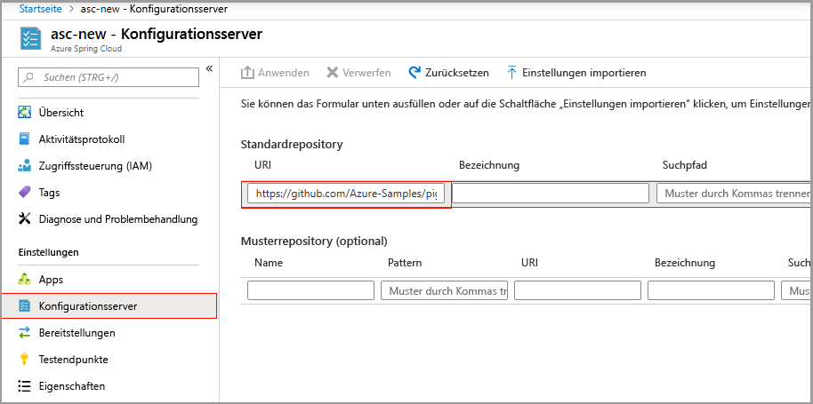

# <a name="quickstart-set-up-azure-spring-cloud-configuration-server"></a>Schnellstart: Einrichten des Azure Spring Cloud-Konfigurationsservers

Der Azure Spring Cloud-Konfigurationsserver ist ein zentralisierter Konfigurationsdienst für verteilte Systeme. Er nutzt eine austauschbare Repositoryebene, die derzeit lokalen Speicher, Git und Subversion unterstützt. In dieser Schnellstartanleitung richten Sie den Konfigurationsserver zum Abrufen von Daten aus einem Git-Repository ein.

::: zone pivot="programming-language-csharp"

## <a name="prerequisites"></a>Voraussetzungen

* Absolvieren Sie den vorherigen Schnellstart in dieser Serie: [Bereitstellen des Azure Spring Cloud-Diensts](spring-cloud-quickstart-provision-service-instance.md)

## <a name="azure-spring-cloud-config-server-procedures"></a>Verfahren für den Azure Spring Cloud-Konfigurationsserver

Richten Sie den Konfigurationsserver mit dem Speicherort des Git-Repositorys für das Projekt ein, indem Sie den folgenden Befehl ausführen. Ersetzen Sie `<service instance name>` durch den Namen des Diensts, den Sie zuvor erstellt haben. Der Standardwert für den Dienstinstanznamen, den Sie in der vorherigen Schnellstartanleitung festgelegt haben, funktioniert nicht mit diesem Befehl.

```azurecli
az spring-cloud config-server git set -n <service instance name> --uri https://github.com/Azure-Samples/Azure-Spring-Cloud-Samples --search-paths steeltoe-sample/config
```

Dieser Befehl weist den Konfigurationsserver an, die Konfigurationsdaten im Ordner [steeltoe-sample/config](https://github.com/Azure-Samples/Azure-Spring-Cloud-Samples/tree/master/steeltoe-sample/config) des Beispiel-App-Repositorys zu suchen. Da der Name der App, die die Konfigurationsdaten abruft, `planet-weather-provider` lautet, heißt die verwendete Datei [planet-weather-provider.yml](https://github.com/Azure-Samples/Azure-Spring-Cloud-Samples/blob/master/steeltoe-sample/config/planet-weather-provider.yml).

::: zone-end

::: zone pivot="programming-language-java"
Der Azure Spring Cloud-Konfigurationsserver ist ein zentralisierter Konfigurationsdienst für verteilte Systeme. Er nutzt eine austauschbare Repositoryebene, die derzeit lokalen Speicher, Git und Subversion unterstützt.  Richten Sie den Konfigurationsserver für die Bereitstellung von Microservice-Apps in Azure Spring Cloud ein.

## <a name="prerequisites"></a>Voraussetzungen

* [Installation von JDK 8](https://docs.microsoft.com/java/azure/jdk/?view=azure-java-stable&preserve-view=true)
* [Registrierung für ein Azure-Abonnement](https://azure.microsoft.com/free/)
* (Optional) [Installation der Azure CLI, Version 2.0.67 oder höher](https://docs.microsoft.com/cli/azure/install-azure-cli?view=azure-cli-latest&preserve-view=true) und Installation der Azure Spring Cloud-Erweiterung mit dem Befehl `az extension add --name spring-cloud`
* (Optional) [Installation des Azure-Toolkits für IntelliJ](https://plugins.jetbrains.com/plugin/8053-azure-toolkit-for-intellij/) und [Anmeldung](https://docs.microsoft.com/azure/developer/java/toolkit-for-intellij/create-hello-world-web-app#installation-and-sign-in)

## <a name="azure-spring-cloud-config-server-procedures"></a>Verfahren für den Azure Spring Cloud-Konfigurationsserver

#### <a name="portal"></a>[Portal](#tab/Azure-portal)

Im folgenden Verfahren wird der Konfigurationsserver mithilfe des Azure-Portals zum Bereitstellen des [Piggy Metrics-Beispiels](spring-cloud-quickstart-sample-app-introduction.md) eingerichtet.

1. Navigieren Sie zur Seite **Übersicht**, und wählen Sie **Konfigurationsserver** aus.

2. Geben Sie im Abschnitt **Standardrepository** für **URI** den Wert „https://github.com/Azure-Samples/piggymetrics-config“ ein.

3. Wählen Sie **Übernehmen** aus, um die Änderungen zu speichern.

    

#### <a name="cli"></a>[BEFEHLSZEILENSCHNITTSTELLE (CLI)](#tab/Azure-CLI)

Im folgenden Verfahren wird die Azure CLI zum Einrichten des Konfigurationsservers und zum Bereitstellen des [Piggy Metrics-Beispiels](spring-cloud-quickstart-sample-app-introduction.md) eingerichtet.

Richten Sie den Konfigurationsserver mit dem Speicherort des Git-Repositorys für das Projekt ein:

```azurecli
az spring-cloud config-server git set -n <service instance name> --uri https://github.com/Azure-Samples/piggymetrics-config
```

---
::: zone-end

## <a name="clean-up-resources"></a>Bereinigen von Ressourcen

Wenn Sie mit der nächsten Schnellstartanleitung in dieser Reihe fortfahren möchten, überspringen Sie diesen Schritt.

In diesen Schnellstartanleitungen haben Sie Azure-Ressourcen erstellt, für die weiterhin Gebühren anfallen, falls sie in Ihrem Abonnement verbleiben. Wenn Sie nicht mit der nächsten Schnellstartanleitung fortfahren möchten und diese Ressourcen in Zukunft nicht mehr benötigen, löschen Sie die Ressourcengruppe über das Portal oder durch Ausführen des folgenden Befehls in Cloud Shell:

```azurecli
az group delete --name <your resource group name; for example: helloworld-1558400876966-rg> --yes
```

Im Rahmen einer vorherigen Schnellstartanleitung haben Sie auch den Namen der Standardressourcengruppe festgelegt. Wenn Sie nicht mit der nächsten Schnellstartanleitung fortfahren möchten, löschen Sie diesen Standardwert, indem Sie den folgenden CLI-Befehl ausführen:

```azurecli
az configure --defaults group=
```

## <a name="next-steps"></a>Nächste Schritte

> [!div class="nextstepaction"]
> [Erstellen und Bereitstellen von Apps](spring-cloud-quickstart-deploy-apps.md)
