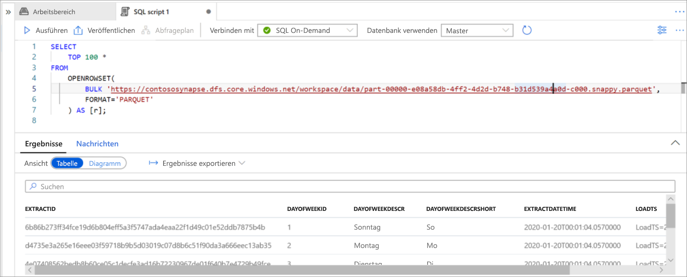

# Schnellstart: Verwenden von Synapse Studio (Vorschauversion)

In dieser Schnellstartanleitung erfahren Sie, wie Sie Dateien mithilfe von Synapse Studio abfragen.

Wenn Sie kein Azure-Abonnement besitzen, können Sie ein [kostenloses Konto](https://azure.microsoft.com/free/) erstellen, bevor Sie beginnen.

## Melden Sie sich auf dem Azure-Portal an.

Melden Sie sich beim [Azure-Portal](https://portal.azure.com/) an.

## Voraussetzungen

[Erstellen Sie einen Azure Synapse-Arbeitsbereich und ein zugehöriges Speicherkonto.](quickstart-create-workspace.md)

## Starten von Synapse Studio

Klicken Sie in Ihrem Azure Synapse-Arbeitsbereich im Azure-Portal auf **Synapse Studio starten**.

Alternativ dazu können Sie Synapse Studio starten, indem Sie auf [Azure Synapse Analytics](https://web.azuresynapse.net) klicken und die entsprechenden Werte für Mandant, Abonnement und Arbeitsbereich eingeben.

## Durchsuchen von Speicherkonten

Navigieren Sie nach dem Öffnen von Synapse Studio zu **Daten**, und erweitern Sie dann **Speicherkonten**, um das Speicherkonto im Arbeitsbereich anzuzeigen.

Mithilfe der Links auf der Symbolleiste können Sie neue Ordner erstellen und Dateien hochladen, um Ihre Dateien zu organisieren.

## Abfragen von Dateien im Speicherkonto

> [!IMPORTANT]
> Sie müssen ein Mitglied der Rolle `Storage Blob Reader` im zugrunde liegenden Speicher sein, um die Dateien abfragen zu können. Lesen Sie, wie Sie die [RBAC-Berechtigung **Storage-Blobdatenleser** oder **Mitwirkender an Storage-Blobdaten** für Azure Storage zuweisen](../storage/common/storage-auth-aad-rbac-portal.md?toc=/azure/synapse-analytics/toc.json&bc=/azure/synapse-analytics/breadcrumb/toc.json#assign-an-azure-built-in-role).

1. Laden Sie einige `PARQUET`-Dateien hoch.
2. Wählen Sie mindestens eine Datei aus, und erstellen Sie dann ein neues SQL-Skript oder ein Spark-Notebook, um den Inhalt der Dateien anzuzeigen. Wenn Sie ein Notebook erstellen möchten, müssen Sie einen [Apache Spark-Pool im Synapse-Arbeitsbereich](quickstart-create-apache-spark-pool-studio.md) erstellen.

   

3. Führen Sie die generierte Abfrage oder das generierte Notebook aus, um den Inhalt der Datei anzuzeigen.

   

4. Sie können die Abfrage ändern, um Ergebnisse zu filtern und zu sortieren. In der [Übersicht über SQL-Features](sql/overview-features.md) finden Sie Informationen zu den in SQL On-Demand verfügbaren Sprachfeatures.

## Nächste Schritte

- Ermöglichen Sie Azure AD-Benutzern das Abfragen von Dateien, indem Sie die [RBAC-Berechtigung **Storage-Blobdatenleser** oder **Mitwirkender an Storage-Blobdaten** für Azure Storage zuweisen](../storage/common/storage-auth-aad-rbac-portal.md?toc=/azure/synapse-analytics/toc.json&bc=/azure/synapse-analytics/breadcrumb/toc.json#assign-an-azure-built-in-role).
- [Abfragen von Dateien in Azure Storage mithilfe von SQL On-Demand](sql/on-demand-workspace-overview.md)
- [Erstellen eines Apache Spark-Pools mit dem Azure-Portal](quickstart-create-apache-spark-pool-portal.md)
- [Erstellen eines Power BI-Berichts für in Azure Storage gespeicherte Dateien](sql/tutorial-connect-power-bi-desktop.md)
