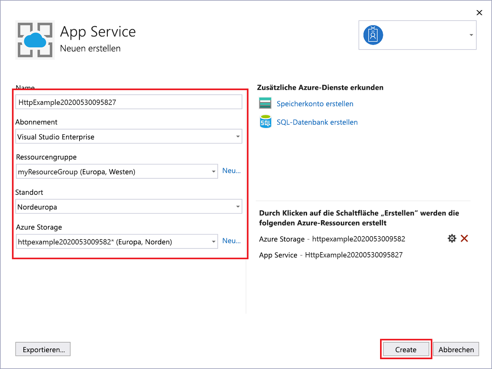

1. Klicken Sie im **Projektmappen-Explorer** mit der rechten Maustaste auf das Projekt, und wählen Sie **Veröffentlichen** aus.

1. Verwenden Sie unter **Veröffentlichungsziel auswählen** die in der folgenden Tabelle angegebenen Veröffentlichungsoptionen: 

    | Option      | BESCHREIBUNG                                |
    | ------------ |  -------------------------------------------------- |
    | **Azure Functions-Nutzungsplan** | Dient zum Erstellen einer Funktions-App in einer Azure-Cloudumgebung, die in einem [Nutzungsplan](../articles/azure-functions/functions-scale.md#consumption-plan) ausgeführt wird. Wenn Sie einen Nutzungsplan verwenden, bezahlen Sie nur für Ausführungen Ihrer Funktions-App. Für andere Hostingpläne fallen höhere Kosten an. Wenn Sie einen anderen Plan als einen Nutzungsplan verwenden müssen Sie die [Skalierung Ihrer Funktions-App](../articles/azure-functions/functions-scale.md) verwalten.| 
    | **Neu erstellen** | Eine neue Funktions-App wird mit zugehörigen Ressourcen in Azure erstellt.  Bei Verwendung von **Vorhandene auswählen** werden alle Dateien in der vorhandenen Funktions-App in Azure durch Dateien aus dem lokalen Projekt überschrieben. Verwenden Sie diese Option nur, wenn Sie Updates für eine vorhandene Funktions-App erneut veröffentlichen. |
    | **Aus Paketdatei ausführen** | Ihre Funktions-App wird unter Verwendung der [ZIP-Bereitstellung](../articles/azure-functions/functions-deployment-technologies.md#zip-deploy) mit aktiviertem Modus [Run-From-Package](../articles/azure-functions/run-functions-from-deployment-package.md) bereitgestellt. Diese Bereitstellung führt zu einer besseren Leistung und wird für die Ausführung Ihrer Funktionen empfohlen.  Wenn Sie diese Option nicht verwenden, stellen Sie vor der Veröffentlichung in Azure sicher, dass das Funktions-App-Projekt nicht lokal ausgeführt wird. |

    :::image type="content" source="media/functions-vstools-publish/functions-visual-studio-publish-profile.png" alt-text="Erstellen eines Veröffentlichungsprofils":::

1. Wählen Sie **Profil erstellen** aus. Falls Sie sich noch nicht über Visual Studio bei Ihrem Azure-Konto angemeldet haben, wählen Sie **Anmelden** aus. Sie können auch ein kostenloses Azure-Konto erstellen.

1. Verwenden Sie unter **App Service: Neu erstellen** die Werte aus der folgenden Tabelle:

    | Einstellung      | Wert  | BESCHREIBUNG                                |
    | ------------ |  ------- | -------------------------------------------------- |
    | **Name** | Global eindeutiger Name | Name, der Ihre neue Funktions-App eindeutig identifiziert. Übernehmen Sie diesen Namen, oder geben Sie einen neuen Namen ein. Gültige Zeichen: `a-z`, `0-9` und `-`. |
    | **Abonnement** | Ihr Abonnement | Das zu verwendende Azure-Abonnement. Übernehmen Sie dieses Abonnement, oder wählen Sie in der Dropdownliste ein neues Abonnement aus. |
    | **[Ressourcengruppe](../articles/azure-resource-manager/management/overview.md)** | Name Ihrer Ressourcengruppe |  Die Ressourcengruppe, in der Ihre Funktions-App erstellt werden soll. Wählen Sie in der Dropdownliste eine vorhandene Ressourcengruppe aus, oder wählen Sie **Neu** aus, um eine neue Ressourcengruppe zu erstellen.|
    | **[Hostingplan](../articles/azure-functions/functions-scale.md)** | Name Ihres Hostingplans | Wählen Sie **Neu** aus, um einen serverlosen Plan zu konfigurieren. Wählen Sie unter **Größe** den **Verbrauch** aus. Wenn Sie Ihr Projekt in einer Funktions-App veröffentlichen, die in einem [Verbrauchsplan](../articles/azure-functions/functions-scale.md#consumption-plan) ausgeführt wird, bezahlen Sie nur für die Ausführungen Ihrer Funktions-App. Für andere Hostingpläne fallen höhere Kosten an. Bei Verwendung eines anderen Plans als **Verbrauch** müssen Sie die [Skalierung Ihrer Funktions-App](../articles/azure-functions/functions-scale.md) verwalten.  |
    | **Location** | Standort des App-Diensts | Wählen Sie einen **Standort** in einer [Region](https://azure.microsoft.com/regions/) in Ihrer Nähe oder in der Nähe anderer Dienste aus, auf die Ihre Funktionen zugreifen. |
    | **[Azure Storage](../articles/storage/common/storage-account-create.md)** | Universelles Speicherkonto | Für die Functions-Runtime wird ein Azure Storage-Konto benötigt. Wählen Sie **Neu** aus, um ein universelles Speicherkonto zu konfigurieren. Sie können auch ein vorhandenes Konto auswählen, das die [Anforderungen an das Speicherkonto](../articles/azure-functions/functions-scale.md#storage-account-requirements) erfüllt.  |

    

1. Wählen Sie **Erstellen** aus, um eine Funktions-App und zugehörige Ressourcen in Azure mit diesen Einstellungen zu erstellen und Ihren Funktionsprojektcode bereitzustellen. 

1. Klicken Sie auf **Veröffentlichen**, und warten Sie, bis die Bereitstellung abgeschlossen ist. 

    Nach Abschluss der Bereitstellung wird die Stamm-URL der Funktions-App in Azure auf der Registerkarte **Veröffentlichen** angezeigt. 
    
1.  Wählen Sie auf der Registerkarte „Veröffentlichen“ die Option **Im Cloud-Explorer verwalten** aus. Dadurch wird die Azure-Ressource für die neue Funktions-App im Cloud-Explorer geöffnet. 
    
    :::image type="content" source="media/functions-vstools-publish/functions-visual-studio-publish-complete.png" alt-text="Veröffentlichen einer Erfolgsmeldung":::
    
    Im Cloud-Explorer können Sie Visual Studio verwenden, um die Inhalte der Website anzuzeigen, die Funktions-App zu starten und anzuhalten und direkt zu Funktions-App-Ressourcen in Azure und im Azure-Portal zu navigieren. 