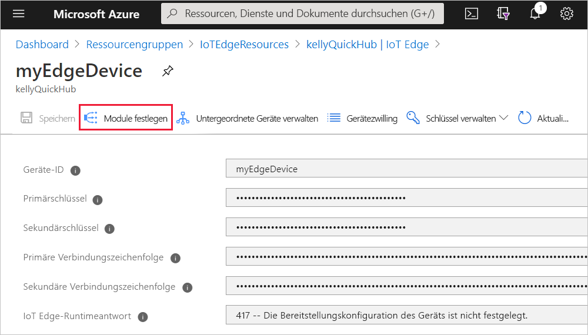
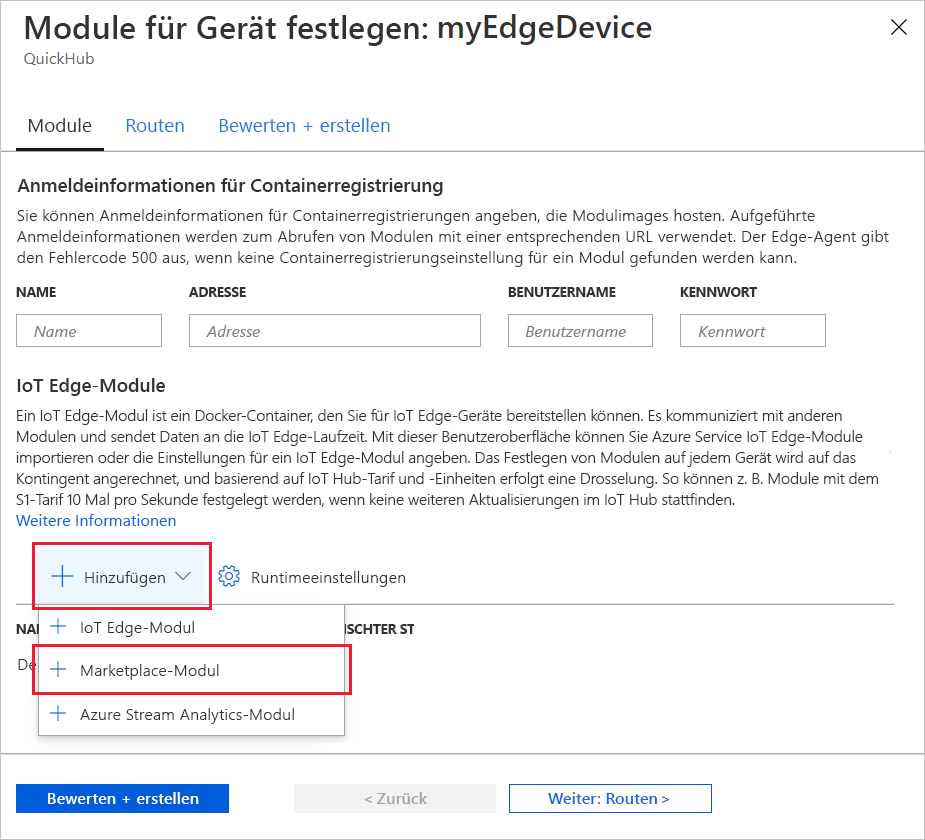

Eine der wichtigen Funktionen von Azure IoT Edge ist die Möglichkeit, Code aus der Cloud auf IoT Edge-Geräten bereitzustellen. Bei *IoT Edge-Modulen* handelt es sich um ausführbare Pakete, die als Container implementiert werden. In diesem Abschnitt stellen Sie ein fertig erstelltes Modul aus dem [Bereich mit den IoT Edge-Modulen im Azure Marketplace](https://azuremarketplace.microsoft.com/marketplace/apps/category/internet-of-things?page=1&subcategories=iot-edge-modules) direkt von Ihrer Azure IoT Hub-Instanz aus bereit.

Mit dem in diesem Abschnitt bereitgestellten Modul wird ein Sensor simuliert, und es werden Daten generiert. Der Code dieses Moduls ist nützlich, wenn Sie die ersten Schritte mit IoT Edge ausführen, weil Sie die simulierten Daten für die Entwicklung und das Testen nutzen können. Wenn Sie genau sehen möchten, was mit diesem Modul durchgeführt wird, können Sie den [Quellcode für den simulierten Temperatursensor anzeigen](https://github.com/Azure/iotedge/blob/027a509549a248647ed41ca7fe1dc508771c8123/edge-modules/SimulatedTemperatureSensor/src/Program.cs).

Führen Sie die folgenden Schritte aus, um über den Azure Marketplace Ihr erstes Modul bereitzustellen:

1. Melden Sie sich beim [Azure-Portal](https://portal.azure.com) an, und navigieren Sie zu Ihrem IoT Hub.

1. Wählen Sie im Menü im linken Bereich unter **Automatische Geräteverwaltung** die Option **IoT Edge** aus.

1. Klicken Sie in der Liste der Geräte auf die Geräte-ID des Zielgeräts.

1. Wählen Sie in der oberen Leiste **Module festlegen** aus.

   

1. Klicken Sie auf der Seite im Abschnitt **IoT Edge-Module** auf **Hinzufügen**, und wählen Sie im Dropdownmenü die Option **Marketplace-Modul** aus.

   

1. Suchen Sie im **IoT Edge-Modul aus Marketplace** nach „Simulierter Temperatursensor“, und wählen Sie das Modul aus.

1. Beachten Sie, dass dem Abschnitt „IoT Edge-Module“ das Modul „SimulatedTemperatureSensor“ (mit dem gewünschten Status **ausgeführt**) hinzugefügt wird.

   Klicken Sie auf **Weiter: Routen**, um mit dem nächsten Schritt des Assistenten fortzufahren.

   

1. Auf der Registerkarte **Routen** des Assistenten können Sie definieren, wie Nachrichten zwischen Modulen und dem IoT-Hub übermittelt werden. Routen werden mit Name-Wert-Paaren erstellt. Auf dieser Seite sollten zwei Routen angezeigt werden. Die Standardroute (mit dem Namen **route**) sendet alle Nachrichten an IoT Hub (`$upstream`). Eine zweite Route mit dem Namen **SimulatedTemperatureSensorToIoTHub** wurde automatisch erstellt, als Sie das Modul aus dem Marketplace hinzugefügt haben. Diese Route sendet alle speziell vom Modul „SimulatedTemperatureSensor“ gesendeten Nachrichten an IoT Hub. Sie können die Standardroute löschen, weil sie in diesem Fall redundant ist.

   Klicken Sie auf **Weiter: Bewerten + erstellen**, um mit dem nächsten Schritt des Assistenten fortzufahren.

   

1. Auf der Registerkarte **Bewerten + erstellen** des Assistenten können Sie eine Vorschau der JSON-Datei anzeigen, in der alle Module definiert sind, die auf Ihrem IoT Edge-Gerät bereitgestellt werden. Beachten Sie, dass hier das Modul **SimulatedTemperatureSensor** sowie die beiden Laufzeitmodule **edgeAgent** und **edgeHub** enthalten sind. Wählen Sie **Erstellen** aus, wenn Sie die Überprüfung abgeschlossen haben.

   Wenn Sie eine neue Bereitstellung an ein IoT Edge-Gerät übermitteln, wird nichts per Push auf Ihr Gerät übertragen. Stattdessen fragt das Gerät den IoT Hub regelmäßig nach neuen Anweisungen ab. Wenn das Gerät ein aktualisiertes Bereitstellungsmanifest findet, werden die Informationen zur neuen Bereitstellung verwendet, um die Modulimages per Pullvorgang aus der Cloud abzurufen. Anschließend wird die lokale Ausführung der Module gestartet. Dieser Vorgang kann einige Minuten in Anspruch nehmen.

1. Nachdem Sie die Bereitstellungsdetails des Moduls erstellt haben, führt Sie der Assistent zur Seite „Gerätedetails“ zurück. Zeigen Sie auf der Seite „Gerätedetails“ den Bereitstellungsstatus auf der Registerkarte **Module** an. Dort sollten drei Module aufgelistet sein: $edgeAgent, $edgeHub und SimulatedTemperatureSensor. Wenn mindestens ein Modul als in der Bereitstellung angegeben aufgeführt ist, vom Gerät aber nicht gemeldet wird, ist Ihr IoT Edge-Gerät noch mit dem Startvorgang beschäftigt. Warten Sie einige Minuten, und wählen Sie oben auf der Seite **Aktualisieren** aus.

   
